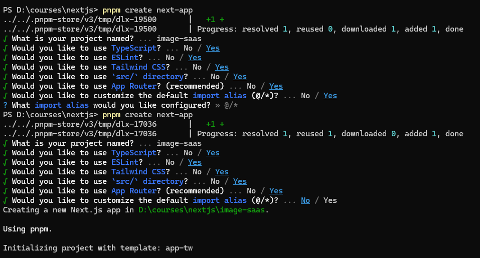

This is a [Next.js](https://nextjs.org/) project bootstrapped
with [`create-next-app`](https://github.com/vercel/next.js/tree/canary/packages/create-next-app).

## Getting Started

Installation the project.



First, run the development server:

```bash
npm run dev
# or
yarn dev
# or
pnpm dev
# or
bun dev
```

Open [http://localhost:3000](http://localhost:3000) with your browser to see the result.

You can start editing the page by modifying `app/page.tsx`. The page auto-updates as you edit the file.

This project uses [`next/font`](https://nextjs.org/docs/basic-features/font-optimization) to automatically optimize and
load Inter, a custom Google Font.

根据drizzle定义的schema创建或修改数据库表结构

```bash
npx drizzle-kit push:pg
```

运行drizzle数据库可视化界面

```bash
npx drizzle-kit studio
```

用户名密码方式登录url

[http://localhost:3000/api/auth/signin](http://localhost:3000/api/auth/signin)

Github OAuth2对接

Open [https://zhuanlan.zhihu.com/p/644330358](https://zhuanlan.zhihu.com/p/644330358) with your browser to see the
result.
